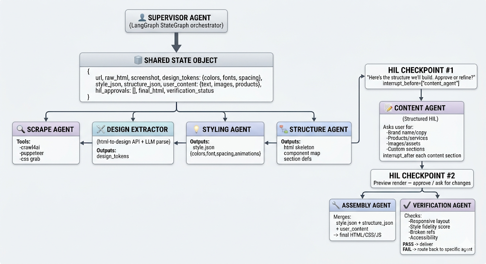
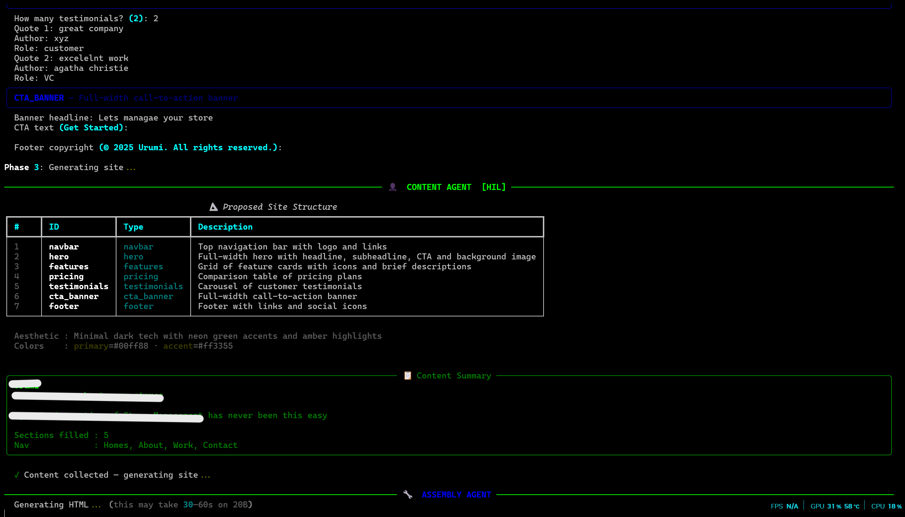
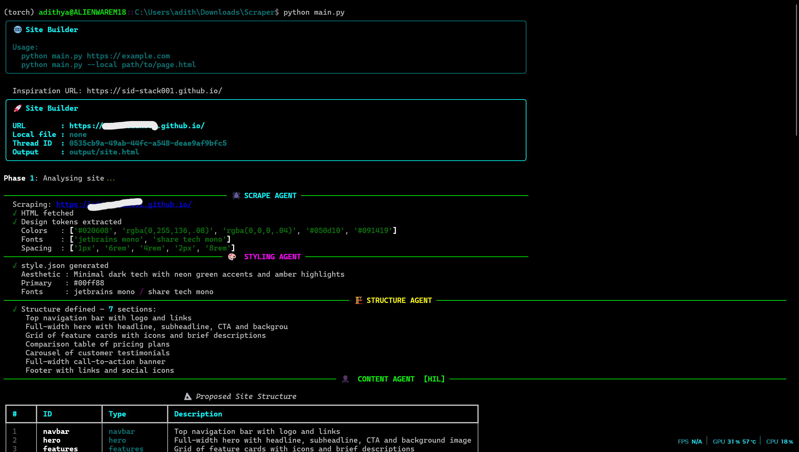

# 🌐 Site Builder — LangGraph + Ollama

> *Give it any URL → scrapes the style → HIL content collection → generates your site*


## Architecture


## Setup

```bash
# 1. Install dependencies
pip install -r requirements.txt

# 2. (Optional) Install Playwright for better scraping
pip install playwright && playwright install chromium

# 3. Make sure Ollama is running
ollama serve
ollama pull gpt-oss:20b   # or whatever model you have
```

## Run

```bash
# Basic usage
python main.py https://stripe.com

# Custom output file
python main.py https://linear.app --out my_site.html

# Interactive (prompts for URL)
python main.py
```

## How HIL Works

The graph **pauses automatically** before the Content Agent:

1. It shows you the proposed **site structure** (sections, layout)
2. You approve or note changes
3. It walks you through **filling in your content** section by section:
   - Brand name, tagline, description
   - Navigation links
   - Hero, features, pricing, testimonials, FAQ etc.
4. Shows a **content summary** for final approval
5. Generates and verifies the HTML

## Files

```
site_builder/
├── main.py               ← entry point
├── graph.py              ← LangGraph state machine
├── state.py              ← shared TypedDict state
├── requirements.txt
├── agents/
│   ├── scrape_agent.py   ← fetches HTML + CSS (no LLM)
│   ├── styling_agent.py  ← extracts style.json (LLM)
│   ├── structure_agent.py← defines sections (LLM)
│   ├── content_agent.py  ← HIL content collection
│   ├── assembly_agent.py ← generates final HTML (LLM)
│   └── verification_agent.py ← rule-based QA (no LLM)
└── tools/
    ├── scraper.py        ← requests / playwright scraper
    └── css_parser.py     ← deterministic CSS token extractor
```

## Customising the Model

In each agent file, change:
```python
llm = ChatOllama(
    model="gpt-oss:20b",      # ← swap to any ollama model
    base_url="http://localhost:11434",
    format="json",            # for agents that output JSON
    temperature=0,
)
```

## Tips for local Models <20B params:

- `format="json"` is set on all JSON-outputting agents — never skip this
- Routing is **deterministic code**, not LLM — reliable at any size
- Verification is **rule-based** — no LLM hallucination risk
- If assembly output is weak, try breaking it into 2 calls in `assembly_agent.py`
  (generate structure first, then fill content)

# Working Screenshots
 
